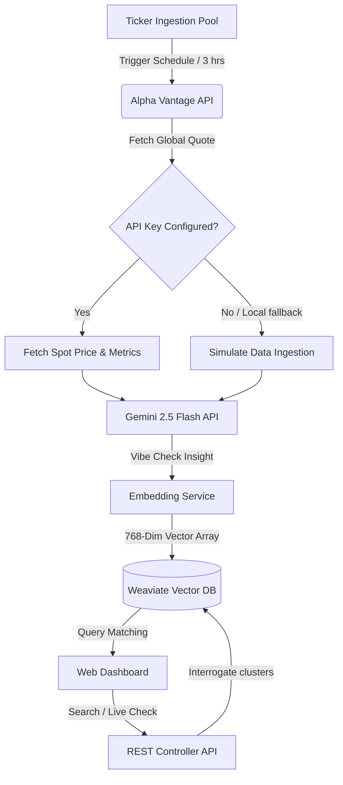

# 🚀 CogniFlow: Intelligent Market Search & AI Intelligence Dashboard

**CogniFlow** is an enterprise-grade financial intelligence engine that bridges real-time market data retrieval, generative AI sentiment engineering, and high-dimensional vector memory retrieval into a clean, modern single-page dashboard.

---

## 🗺️ Architectural Workflow

CogniFlow utilizes a scheduled, decoupled data ingestion pipeline paired with a hybrid semantic search engine:



---

## ✨ Features

### 1. 🔍 Hybrid Natural Language Search
- **Dual Retrieval Mode**: Combines semantic vector distance calculations with classic BM25 keyword matching to surface accurate context matches.
- **Symbol Filtering**: A dynamic drop-down selector lets analysts instantly isolate search results by specific stock ticker symbol.
- **Query Caching**: Stores recent search keywords in local storage and serves them as clickable chips for fast re-execution.
- **Debounced Inputs**: Triggers search-on-type with a 300ms debounce buffer to minimize redundant vector calculations.

### 2. 📊 Master-Detail AI Analysis Interface
- **Resizable Layout**: A responsive, two-column layout on desktop featuring a custom JavaScript-based draggable panel splitter to scale details.
- **Relevance Indicators**: Displays exact matching percentages and deterministic 5-star ratings for each search result card.
- **Detail Metrics**: Selecting any result card loads full text, spot prices, and formatted dates, with options to **Copy Output** or **Export as .txt**.
- **Usage & Cost Projection**: Displays estimated LLM token usage (calculated on text length) and free price markers.

### 3. 🚦 Keyless Local Mock Fallback
- **Anonymous Weaviate Access**: Automatically skips cloud API authentication when connection URLs resolve to `localhost` or `127.0.0.1`.
- **Text-Hash Embedding Simulator**: Falls back to generating deterministic vector embeddings based on text hashes if Gemini API keys are omitted in development, allowing developers to run full searches locally without crashes or credentials.

### 4. ⚙️ Operational Diagnostics & Onboarding
- **Diagnostics Console**: An slide-up troubleshooting drawer that collects and visualizes local storage logs of system errors.
- **Diagnostics Clipboard Dump**: "Report Issue" gathers system properties, logs, caching states, and browser metadata into a JSON block ready for clipboard pasting.
- **Onboarding Tour**: An interactive guided tour wizard that walks first-time users through memory searching, live runs, and metrics panel features.

---

## 🛠️ Technology Stack

- **Backend Framework**: Java 17+ with Spring Boot 3.5.x
- **Vector Database**: Weaviate v4 (running locally via Docker or in Weaviate Cloud)
- **Generative AI**: Google Gemini API (Gemini 2.5 Flash model)
- **Market Data Provider**: Alpha Vantage API
- **Frontend Engine**: Vanilla HTML5, JavaScript (ES6+), and CSS3 with Tailwind CDN
- **Resiliency & Circuit Breakers**: Resilience4j (annotated client guardrails)
- **OpenAPI Tooling**: Springdoc OpenAPI (Swagger UI)

---

## 🚀 Getting Started

### Prerequisites
- **Java JDK**: 17 or higher
- **Docker & Docker Desktop**: Installed and running
- **Maven**: (Wrapper script `./mvnw` is included in the project root)

### 1. Environment Configurations
Configure parameters inside `src/main/resources/application.properties` or set matching OS environment variables:

```properties
# API Key Credentials
cogniflow.alphavantage-api-key=YOUR_ALPHA_VANTAGE_KEY
cogniflow.google-ai-api-key=YOUR_GEMINI_API_KEY
cogniflow.job-secret=YOUR_CRON_SCHEDULER_SECRET_TOKEN

# Weaviate Cluster Configuration (Defaults for local docker-compose)
cogniflow.weaviate.host=localhost
cogniflow.weaviate.port=8081
cogniflow.weaviate.scheme=http
# cogniflow.weaviate.api-key=YOUR_WEAVIATE_CLOUD_API_KEY (Optional for remote instances)
```

### 2. Run Local Infrastructure
Spin up the local Weaviate vector database:
```bash
docker-compose up -d
```
This initializes a persistent Weaviate datastore exposed on port `8081` (anonymous access).

### 3. Start Spring Boot App
Compile and boot up the server:
```bash
./mvnw spring-boot:run
```
Once booted, the application runs on [http://localhost:8080](http://localhost:8080).

### 4. Populate Local Database with Mock Data
To populate the empty vector database with mock stock sentiment insights for AAPL, MSFT, and IBM:
```bash
python "C:\Users\Shrish\.gemini\antigravity-ide\scratch\populate_mock_weaviate.py"
```

---

## 🧪 Testing

The codebase includes integration tests that leverage Testcontainers to spin up temporary Weaviate environments.
Run the complete testing suite using:
```bash
./mvnw test
```

---

## 🔍 API Endpoints

CogniFlow registers interactive swagger documentation available locally at:
👉 **[http://localhost:8080/swagger-ui.html](http://localhost:8080/swagger-ui.html)**

### Public REST Interface

| HTTP Method | Endpoint | Query Parameters | Description |
| :--- | :--- | :--- | :--- |
| **GET** | `/api/insights/search` | `query` (str), `limit` (int), `hybrid` (bool) | Query stored database insights using hybrid semantic search. |
| **GET** | `/api/insights/live/{symbol}`| None | Run a live check: fetch spot price from Alpha Vantage, pass to Gemini, and save vector. |
| **GET** | `/api/insights/pipeline/status`| None | Retrieve global runtimes, total records count, and individual ticker freshness metrics. |
| **GET** | `/api/tickers` | None | Get list of currently tracked stock tickers. |
| **POST** | `/api/tickers/{symbol}` | None | Add a symbol to the scheduled tracking pool. |
| **DELETE**| `/api/tickers/{symbol}` | None | Remove a symbol from the scheduled tracking pool. |

---

## ☁️ Serverless Deployment (Google Cloud Run)

This project contains deployment scripts and configurations tailored for **Google Cloud Build** and **Google Cloud Run**:

1. **Decoupled Job Execution**:
   Scheduled cron runs are triggered externally via Google Cloud Scheduler sending authenticated requests to `/api/internal/run-scan` containing the `X-CloudScheduler-JobSecret` header. This allows the Cloud Run container instance to safely scale down to **0 instances** when idle, incurring zero idle-billing costs.

2. **Triggering Deployment**:
   Pushing changes to the repository's `deployGC` branch initiates Google Cloud Build via `cloudbuild.yaml`:
   ```bash
   git add .
   git commit -m "Commit message"
   git push origin deployGC
   ```
   Google Cloud Build automatically compiles the jar, containers it using the `Dockerfile`, registers it with Google Artifact Registry, and deploys the revision to Cloud Run.
