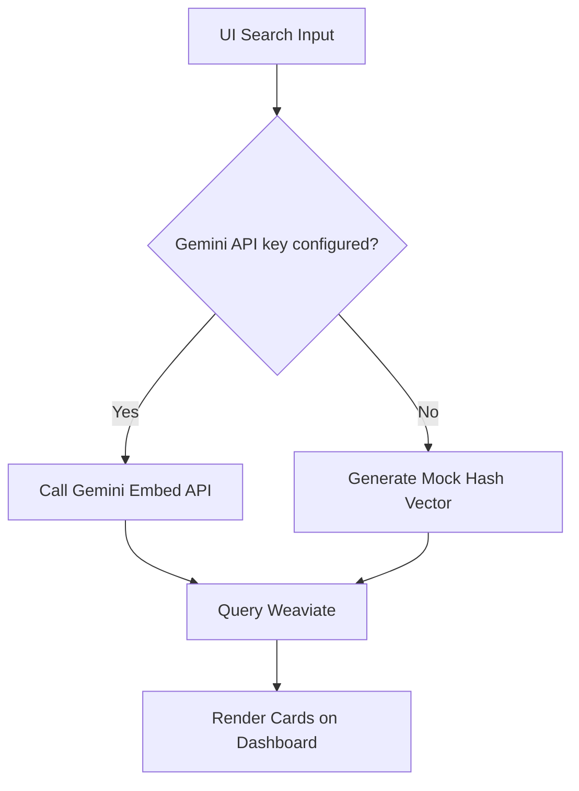

# CogniFlow

[](https://adoptium.net/)
[](https://spring.io/)
[](https://weaviate.io/)

CogniFlow is a stock analysis dashboard. It pulls live market data, asks Groq (Llama 3) for a quick sentiment summary (a "vibe check"), and stores everything in a Weaviate vector database. Then you can search those insights using plain English.

Live demo: [https://cogniflowservice-349799058791.europe-west1.run.app/](https://cogniflowservice-349799058791.europe-west1.run.app/)

---

## How it works

1. **Ingest** – The app fetches stock quotes from Alpha Vantage.
2. **AI vibe check** – The price and change go to Groq (`llama-3.1-8b-instant`), which returns a 2-sentence market sentiment summary.
3. **Vector storage** – That summary gets turned into an embedding (via Gemini's embedding API, falling back to simulated vectors if the quota is hit) and saved in Weaviate.
4. **Search UI** – You type a question into the dashboard, and it runs a hybrid search (keywords + vector similarity) over the stored insights.



---

## Tech stack

- **Backend**: Java 17 + Spring Boot 3.5
- **Vector DB**: Weaviate v1.25 (running in Docker, accessed via Java Client v4)
- **AI & embeddings**: Groq (`llama-3.1-8b-instant`) & Google Gemini Embedding (`gemini-embedding-001` with a robust free-tier fallback)
- **Market data**: Alpha Vantage API
- **Frontend**: plain HTML/JS + Tailwind CSS

---

## Features

- Natural language search over stock insights using hybrid (BM25 + vector) search
- AI-generated "vibe check" summaries for any stock ticker
- Dashboard UI with resizable panels, relevance indicators, and export options
- Local mock fallback – search works without API keys (deterministic mock vectors)
- REST API to manage tracked tickers (add/remove symbols from the ingestion pool)

---

## Prerequisites

- Docker & Docker Compose
- Java 17+
- Python 3 (only needed for running the mock database seeder script)
- *(Optional)* Alpha Vantage, Groq, & Google Gemini API keys – required for live data fetching

---

## Local development (read this first)

To make local development easier without needing API keys for everything:

- **Mock embeddings**: If `cogniflow.google-ai-api-key` is missing or left as a placeholder, search still works. The app generates deterministic mock vectors from string hashes.
- **Ingestion fails without keys**: Running a live ticker fetch on the dashboard (`/api/insights/live/{symbol}`) will fail with a 503 if you don't have valid Alpha Vantage or Gemini keys. The app does not simulate live fetches.
- **Job Secret**: Ensure `cogniflow.job-secret` in your local `application.properties` has a placeholder value set, otherwise context startup validation will fail.
- **Database seeding**: To test the UI locally without credentials, run the included Python script to inject pre-made vector data into Weaviate.

---

## Setup and running

### 1. Start Weaviate
Weaviate runs in a Docker container:
```bash
docker-compose up -d
```
This binds Weaviate to port `8081` on your local machine.

### 2. Configure credentials
Edit `src/main/resources/application.properties`:
```properties
cogniflow.alphavantage-api-key=YOUR_ALPHA_VANTAGE_KEY
cogniflow.google-ai-api-key=YOUR_GEMINI_API_KEY
cogniflow.groq-api-key=YOUR_GROQ_API_KEY
cogniflow.job-secret=YOUR_SCHEDULER_SECRET

cogniflow.weaviate.host=localhost
cogniflow.weaviate.port=8081
cogniflow.weaviate.scheme=http
```

### 3. Load mock data
Run the helper script to populate Weaviate with mock insights for AAPL, MSFT, and IBM:
```bash
python scripts/populate_mock_weaviate.py
```

### 4. Run the app
```bash
./mvnw spring-boot:run
```
Open [http://localhost:8080/](http://localhost:8080/) in your browser.

---

## Running tests

Integration tests spin up a temporary Weaviate container using Testcontainers. Make sure Docker is running, then:
```bash
./mvnw test
```

---

## API endpoints

Swagger docs are available at [http://localhost:8080/swagger-ui.html](http://localhost:8080/swagger-ui.html).

| Method | Endpoint | Description |
| :--- | :--- | :--- |
| **GET** | `/api/insights/search?query={q}&limit={n}&hybrid={true/false}` | Searches stored insights using hybrid (BM25 + vector) query modes. |
| **GET** | `/api/insights/live/{symbol}` | Fetches a live quote, generates a Gemini summary, and saves to Weaviate. (Requires API keys.) |
| **GET** | `/api/insights/pipeline/status` | Returns total record count and ingestion health for tracked tickers. |
| **POST** | `/api/internal/run-scan` | Manually triggers a batch scan of the ingestion pool. Requires header `X-CloudScheduler-JobSecret`. |
| **GET** | `/api/tickers` | Lists all tracked tickers. |
| **POST** | `/api/tickers/{ticker}` | Adds a ticker to the ingestion pool. |
| **DELETE** | `/api/tickers/{ticker}` | Removes a ticker from the ingestion pool. |

---

## Cloud deployment

*Note: This section is for production deployment. Skip it for local development.*

The app is set up to deploy to Google Cloud Run via Google Cloud Build.
Pushing to the `deployGC` branch triggers the build automatically:
```bash
git add .
git commit -m "Update application configs"
git push origin deployGC
```

The scheduled scans run serverless: a Cloud Scheduler job periodically hits `/api/internal/run-scan` with the required authorization header. That way the Cloud Run container can scale to zero when idle. For detailed instructions on provisioning the OIDC service account and creating the Cloud Scheduler job, see the [GCP Deployment Guide](docs/gcp_deployment_guide.md).

---

## License

This project is for internal and educational use.
